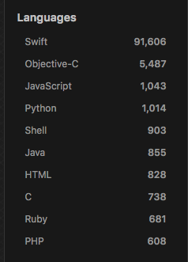
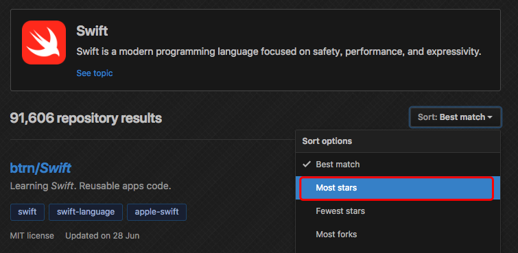

# 爬取GitHub

目的：

1. 根据关键词、以及语言（可选）爬取`GitHub`上`star`数最多的仓库
2. 根据作者爬取他`GitHub`上的仓库

仓库需要包含的信息：

1. 仓库名称
2. 作者名称
3. `star`数
4. 仓库简介
5. 相关标签
6. 最后一次更新时间
7. 协议

进阶可选：

1. `fork`数

## 分析网页

### URL

假设我们现在需要学习`Swift`这门语言，并想要通过`GitHub`上的一些开源项目来学习

我们需要执行以下步骤：

1. 在搜索栏键入我们的关键词`swift`，并在`All GitHub`中搜索

2. 通常我们从第一步中获取的结果往往包含其他语言，第二步我们可以在搜索结果的侧边栏选择我们需要的`Language`

   

3. 选择我们想要的语言之后，我们还可以选择排序，以显示`star`数从高到低的仓库列表

   


通过上述3步，我们可以在浏览器中获得我们的查询结果页面，同时能获取当前的`url`：https://github.com/search?l=Swift&o=desc&q=swift&s=stars&type=Repositories

可以看出`url`中包含了5个参数

分别是:

- `l`：值=`Swift`，是对应`language`的缩写
- `q`：值=`swift`，是我们搜索的关键词
- `type`：值=`Reponsitories`，表示搜索类别是仓库
- `o`：值=`desc`，order 排序的缩写
- `s`：值=`stars`，暂时不知道是什么的缩写，猜测是配合排序使用的

### XPath

使用`XPath`获取网页上的内容，[W3C XPath 语法](http://www.w3school.com.cn/xpath/xpath_syntax.asp)

1. 仓库：`//ul[@class="repo-list"]`
2. 仓库列表：仓库+`/child::*`
   1. 仓库名称/作者名称 ：`//h3/a/@href`，注：需要根据`/`分割字符串
   2. 仓库简介：`//p[contains(@class,"d-inline-block")]`
   3. 标签列表：`//a[contains(@class,"topic-tag")]`
   4. 证书&更新时间：`//div[@class="d-flex flex-wrap"]`
      1. 证书：`//p[position()=1]`
      2. 更新时间：`//relative-time/@datetime`
   5. 仓库语言：`//span[@class="repo-language-color"]`
   6. star数：`//a[@class="muted-link"]`

## Python实现

目前只实现了第一页的爬取，以及相关数据未存入数据库中

```python
import requests
from lxml import html


class GithubRepo:

    name = ''
    author = ''
    summary = ''
    tag_list = []
    license = ''
    lastUpdateTime = ''
    language = ''
    star_num = 0

    def tostring(self):
        print(self.__dict__)


keyWorld = 'swift'
language = 'Swift'
URL = ('https://github.com/search?l=%s&o=desc&q=%s&s=stars&type=Repositories' % (language, keyWorld))

session = requests.session()
response = session.get(URL)

tree = html.fromstring(response.text)
repo_list = []
# 仓库列表
repo_html_list = tree.xpath('//ul[@class="repo-list"]/child::*')
for repo_html in repo_html_list:
    repo = GithubRepo()
    # 注意这里的. 表示从当前元素下获取子元素，如果没有，则会从全局html中获取
    repo.name = repo_html.xpath('.//h3/a/@href')[0].split('/')[2]
    repo.author = repo_html.xpath('.//h3/a/@href')[0].split('/')[1]
    # text属性只包含了当前节点的text，而没有包含子节点的，因此需要使用text_content()方法
    repo.summary = repo_html.xpath('.//p[contains(@class,"d-inline-block")]')[0].text_content().strip()
    # 由于标签包含许多空格以及\n，需要去除
    repo.tag_list = list(map(lambda x: x.strip(), repo_html.xpath('.//a[contains(@class,"topic-tag")]/text()')))
    repo.license = repo_html.xpath('.//div[@class="d-flex flex-wrap"]//p[position()=1]')[0].text.strip()
    repo.lastUpdateTime = repo_html.xpath('.//div[@class="d-flex flex-wrap"]//relative-time/@datetime')[0]
    repo.language = repo_html.xpath('.//span[@class="repo-language-color"]/parent::div[1]')[0].text_content().strip()
    repo.star_num = repo_html.xpath('.//a[@class="muted-link"]')[0].text_content().strip()
    repo_list.append(repo)

# 输出爬取结果
for repo in repo_list:
    repo.tostring()

```

## 总结

关于`GitHub-day1`爬虫思路：

1. 明确需要且可获取的数据
2. 解析请求参数：各参数的含义&可选值
3. 解析网页结构：编写各个属性的`XPath`表达式，并确保能通过`XPath`获取到唯一的元素（或属性）
4. 最后通过`Python`实现


