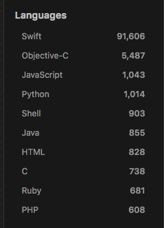
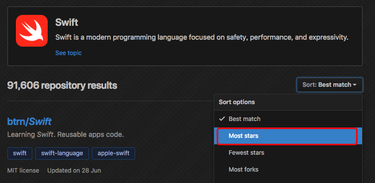

# 爬取GitHub

从day1中我们已经可以爬取`GitHub`第一页搜索结果的内容了
现在我们来实现一下
* 多页

## 分析网页

### URL

假设我们现在需要学习`Swift`这门语言，并想要通过`GitHub`上的一些开源项目来学习

我们需要执行以下步骤：

1. 在搜索栏键入我们的关键词`swift`，并在`All GitHub`中搜索

2. 通常我们从第一步中获取的结果往往包含其他语言，第二步我们可以在搜索结果的侧边栏选择我们需要的`Language`

   

3. 选择我们想要的语言之后，我们还可以选择排序，以显示`star`数从高到低的仓库列表

   

通过上述3步，我们可以在浏览器中获得我们的查询结果页面，同时能获取当前的`url`：https://github.com/search?l=Swift&o=desc&q=swift&s=stars&type=Repositories

可以看出`url`中包含了5个参数

分别是:

- `l`：值=`Swift`，是对应`language`的缩写
- `q`：值=`swift`，是我们搜索的关键词
- `type`：值=`Reponsitories`，表示搜索类别是仓库
- `o`：值=`desc`，order 排序的缩写
- `s`：值=`stars`，暂时不知道是什么的缩写，猜测是配合排序使用的

### XPath

使用`XPath`获取网页上的内容，[W3C XPath 语法](http://www.w3school.com.cn/xpath/xpath_syntax.asp)

1. 仓库：`//ul[@class="repo-list"]`
2. 仓库列表：仓库+`/child::*`
   1. 仓库名称/作者名称 ：`//h3/a/@href`，注：需要根据`/`分割字符串
   2. 仓库简介：`//p[contains(@class,"d-inline-block")]`
   3. 标签列表：`//a[contains(@class,"topic-tag")]`
   4. 证书&更新时间：`//div[@class="d-flex flex-wrap"]`
      1. 证书：`//p[position()=1]`
      2. 更新时间：`//relative-time/@datetime`
   5. 仓库语言：`//span[@class="repo-language-color"]`
   6. star数：`//a[@class="muted-link"]`

## Python实现

目前只实现了第一页的爬取，以及相关数据未存入数据库中
见

## 总结

关于`GitHub-day1`爬虫思路：

1. 明确需要且可获取的数据
2. 解析请求参数：各参数的含义&可选值
3. 解析网页结构：编写各个属性的`XPath`表达式，并确保能通过`XPath`获取到唯一的元素（或属性）
4. 最后通过`Python`实现

